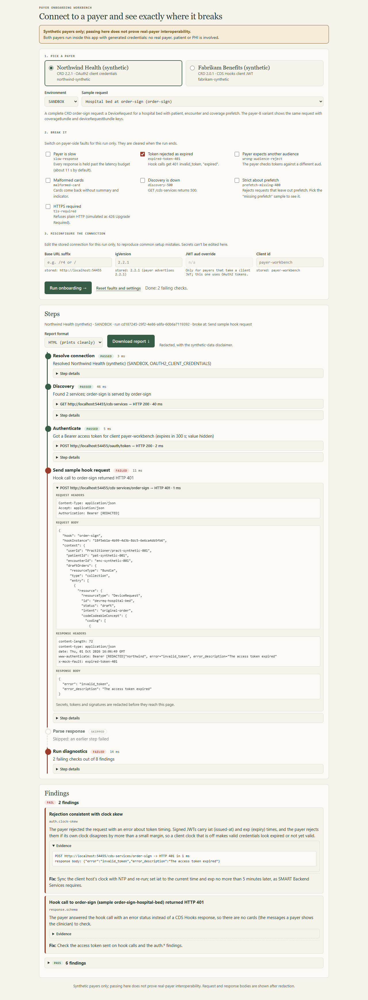
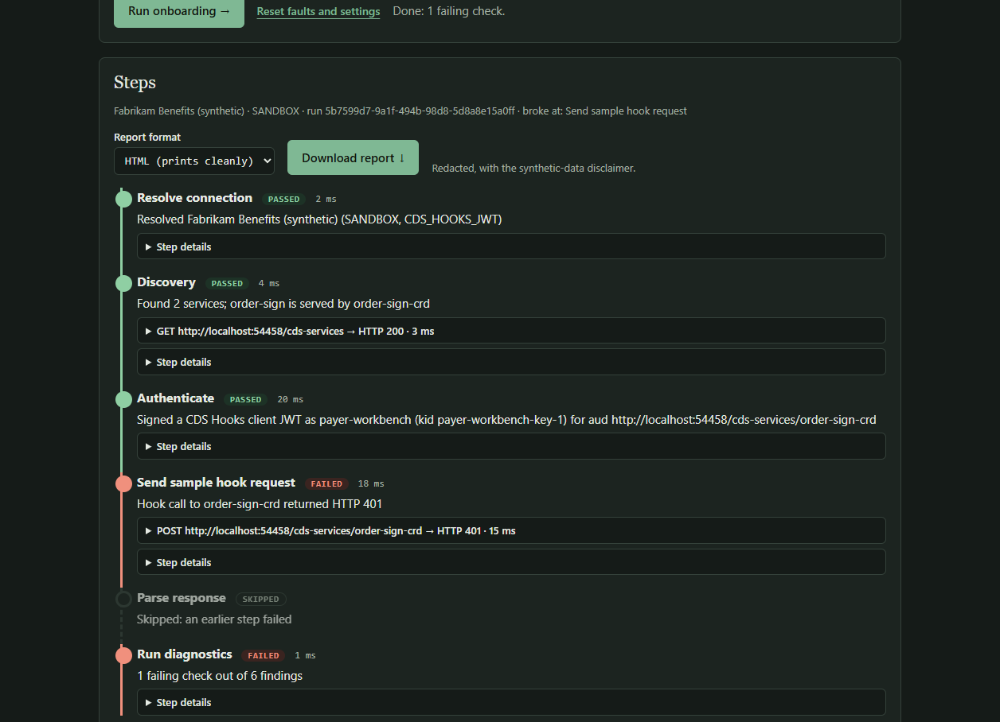
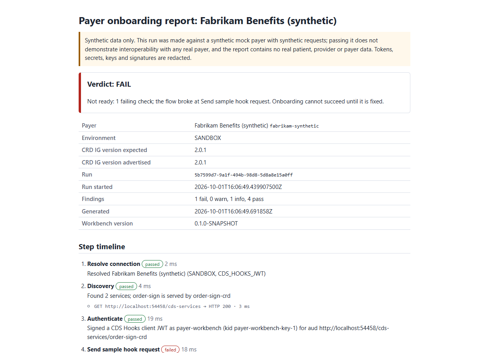
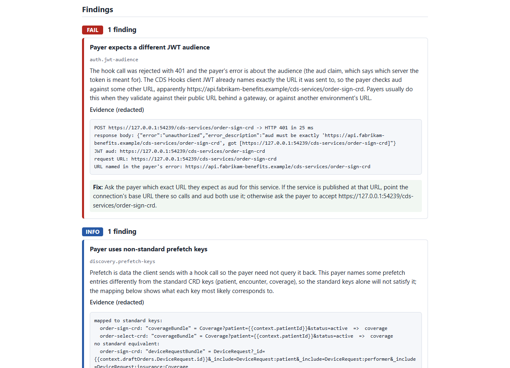
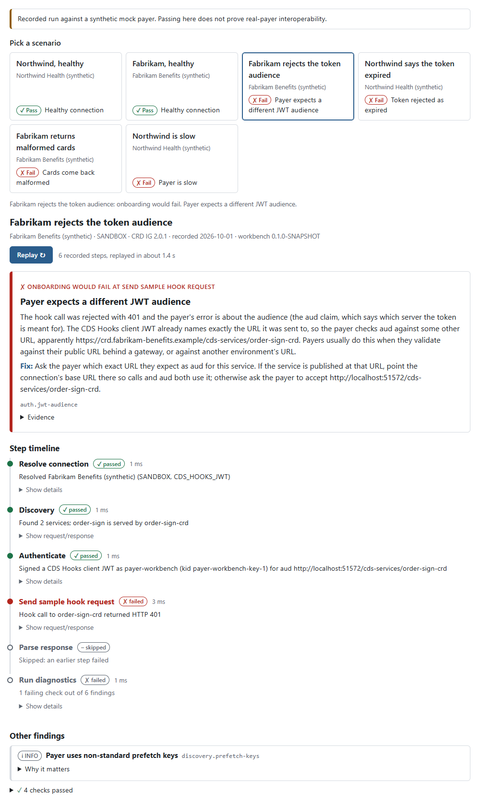

# Payer Onboarding Workbench

Connect to a (synthetic) insurance payer's FHIR CRD / CDS Hooks endpoint, inspect its discovery response, run sample requests, and get a plain-language diagnostic report when something goes wrong.

Built on [fhir-crd-router](https://github.com/dflippojr/fhir-crd-router), which stays independently usable; this workbench is an optional consumer of it.

**Status:** v1 is done. The onboarding flow (API and browser UI), the two mock payers, the diagnostic checks, the sample library, report export, the scripted demo and the replay bundle are merged, and the replay is live on [dflippojr.dev](https://dflippojr.dev/). Later work is tracked in [GitHub issues](https://github.com/dflippojr/payer-onboarding-workbench/issues).

All data is synthetic. No real payers, patients, or PHI. A passing run against the mock payers does not establish interoperability with any real payer.

## Develop

Requires JDK 21. Maven is not needed; use the wrapper.

fhir-crd-router is not on Maven Central yet, so install it into your local Maven repository first. The script clones the pinned commit into `.deps/` (gitignored) and runs its build:

```sh
./scripts/install-crd-router.sh        # macOS, Linux, Git Bash
```

```powershell
.\scripts\install-crd-router.ps1       # Windows PowerShell
```

Build and run the tests:

```sh
./mvnw verify
```

Run the app (serves on http://localhost:8080 by default). Install the sibling modules once, then run `workbench-app` on its own; adding `-am` to `spring-boot:run` fails on the parent pom, which has no main class:

```sh
./mvnw install -DskipTests
./mvnw -pl workbench-app spring-boot:run
./mvnw -pl workbench-app spring-boot:run -Dspring-boot.run.arguments=--server.port=9090   # another port
```

CI runs two GitHub Actions workflows on pushes and pull requests:

- `.github/workflows/ci.yml` installs fhir-crd-router, runs `./mvnw -B verify`, then the [demo tour](#demo), the [replay export](#embed-on-a-website) and its bundle check, and uploads `demo-output/` and `site-dist/` as build artifacts.
- `.github/workflows/sonar.yml` runs `verify` with JaCoCo coverage and the SonarCloud scanner, and fails when the SonarCloud quality gate fails. It runs on pushes to `main` and on pull requests from branches in this repository (forks get no secrets, so it skips them). The organization and project keys are in the parent `pom.xml`.

Modules:

| Module | Purpose |
|--------|---------|
| `workbench-core` | Shared contracts and `Redactor`. Pure Java, no Spring. |
| `mock-payers` | Two embedded synthetic CDS Hooks payers. |
| `diagnostics` | Diagnostic checks and the engine that runs them. |
| `samples` | Synthetic request payloads. |
| `workbench-app` | Spring Boot app: REST API and static UI. |

Design decisions and how to override them: [DECISIONS.md](DECISIONS.md).

## Onboarding flow

`workbench-app` walks you through connecting to a payer and shows exactly where it breaks. Start it and open http://localhost:8080:

```sh
./mvnw install -DskipTests                  # once, so the app's sibling modules are in your local repository
./mvnw -pl workbench-app spring-boot:run
```



On startup the app launches all three mock payers in-process on loopback ephemeral ports and seeds a `SANDBOX` `ConnectionRecord` for each in a directory-core `FileBasedConnectionStore` under a temp directory (owner-only where the file system supports POSIX permissions, and deleted on shutdown). Credentials (Northwind's client secret, Fabrikam's and Tailspin's separate RSA signing keys) are generated at startup and held only in memory; they are never written to disk, logged or returned by the API.

A run records these steps, each with its status, latency and redacted HTTP exchanges. The first failing step stops the run; the rest are marked skipped, and diagnostics run on whatever was observed.

1. **Resolve connection**: look up the record for the payer and environment, then apply any edits.
2. **Discovery**: `GET {baseUrl}/cds-services`, then find the service for the sample's hook.
3. **Authenticate**: an OAuth2 client-credentials token (Northwind) a signed CDS Hooks client JWT (Fabrikam), or SMART Backend Services `private_key_jwt` (Tailspin).
4. **Send the sample hook request**, with the prefetch keys the payer's discovery asks for.
5. **Parse the response** with the fhir-crd-router client types (cards, system actions, coverage information).
6. **Run diagnostics** (`DiagnosticEngine`, with the sample's hook as the required hook).

Discovery and hook calls go through the router's `CdsHooksClient`, which owns authentication, token caching, retries, timeouts and response parsing. Discovery uses an unauthenticated copy of the connection because both synthetic payers advertise public discovery. The SDK's TOKEN and HOOK exchange events populate the separate Authenticate and Hook request steps; an OAuth2 401 shows both hook attempts and the token refresh. Diagnostics evaluate the final hook outcome once. For the JWT payer, a transport observer retains only the claims of the JWT the SDK actually sends. Token event bodies contain only `token_type`, `expires_in` and `scope`; token failures use the SDK's sanitized typed error metadata.

The UI has a payer picker, a "Break it" panel of payer faults, connection settings you can edit for one run (base URL suffix, `igVersion`, client id; never a secret), a step timeline with expandable request/response, and findings grouped by severity with explanation and fix, plus a **Download report** button (HTML, Markdown or JSON) once a run finishes. It follows `prefers-color-scheme`, works at 375 px and is keyboard navigable. It is plain HTML, CSS and JS under `workbench-app/src/main/resources/static`, with no build step.

### API

| Method and path | Does |
|---|---|
| `GET /api/payers` | The synthetic payers, their stored connections (redacted), editable settings and fault ids. |
| `GET /api/samples` | Sample request metadata. |
| `POST /api/runs` | Runs the steps and returns an `OnboardingRun`. Body: `payerId`, `environment` (default `SANDBOX`), `sampleId`, optional `faults` (fault ids), `slowResponseDelayMs`, and `connection` edits (`baseUrlSuffix`, `igVersion`, `clientId`). |
| `GET /api/runs/{id}` | A recent run (the last 200 are kept in memory). |
| `GET /api/runs/{id}/report?format=md\|html\|json` | A shareable diagnostic report of a recent run (default `html`). `400` for another format, `404` for an unknown run. |

```sh
curl -s localhost:8080/api/runs -H 'Content-Type: application/json' \
  -d '{"payerId":"northwind-synthetic","sampleId":"order-sign-hospital-bed","faults":["expired-token-401"]}'
```

Faults apply to one run only; runs against the same payer are serialized so faults never leak between them.

### Diagnostic reports

`GET /api/runs/{id}/report` turns a run into a report you can attach to a ticket or send to a payer. Every format covers the same ground: the verdict (`PASS`, `PASS_WITH_WARNINGS` or `FAIL`, and the step where the flow broke), the payer, environment and CRD IG version (expected by the connection and advertised by the payer), the run's correlation id (see [Observability](#observability)), the step timeline with each HTTP exchange, findings by severity (most severe first) with explanation, redacted evidence and fix, when it was generated and by which workbench version, and the synthetic-data / no-interoperability disclaimer.

- `html` is one self-contained file (inline CSS, no scripts or external assets) that prints cleanly: findings are not split across pages and severity colours are kept.
- `md` is for pasting into an issue or a wiki.
- `json` is the same report as data, including each step's full (redacted) details.

Redaction is applied again when the report is built, on top of the redaction already done when exchanges and findings are recorded: every string goes through `Redactor`, and any field named like a secret (`client_secret`, `access_token`, `Authorization`, `privateKey` and similar) is masked. `RunReportTest` plants a bearer token, a client secret, a JWT signature and a PEM private key in a run's step details and findings and checks that none of them reach any format.

```sh
curl -s "localhost:8080/api/runs/$RUN_ID/report?format=md" -o report.md
```



### What each fault and misconfiguration fails

The integration tests (`OnboardingFlowTest`) hold the app to this table on both payers.

| Fault or edit | Breaks at | FAIL `checkId` |
|---|---|---|
| none (healthy run) | nothing | none |
| `slow-response` | (steps pass; only the hook call is slow) | `perf.latency` |
| `expired-token-401` | hook request | `auth.clock-skew`, `response.schema` |
| `wrong-audience-reject`, Fabrikam | hook request | `auth.jwt-audience` |
| `wrong-audience-reject`, Northwind | hook request | `response.schema` |
| `wrong-audience-reject`, Tailspin | authenticate | `auth.client-assertion` (expected and sent `aud`) |
| `coverage-info-incomplete` (both payers, `order-sign`) | diagnostics | `response.coverage-information` |
| `malformed-card` | parse response | `response.schema` |
| `discovery-500` | discovery | `discovery.reachable` |
| `prefetch-missing-400`, with sample `order-sign-missing-prefetch` | hook request | `response.schema` |
| `untrusted-certificate` | discovery | `tls.handshake` (untrusted CA) |
| `expired-certificate` | discovery | `tls.handshake` (expired certificate) |
| `hostname-mismatch` | discovery | `tls.handshake` (different host) |
| base URL suffix `/r4` | discovery | `discovery.reachable` |
| `igVersion` `1.0.0` | (steps pass) | `ig.version` |
| wrong client id, Northwind | authenticate | `auth.token` |
| wrong client id, Tailspin | authenticate | `auth.token`, `auth.client-assertion` |
| wrong client id, Fabrikam | hook request | `response.schema` |
| environment `PRODUCTION` (no record) | resolve connection | `connection.record` |

`response.coverage-information` validates every coverage-information extension in system actions and card suggestions using the router's Da Vinci CRD 2.2.1 validator. Evidence identifies the resource, extension location, and each violation's path and message. ERROR violations produce FAIL, WARNING violations produce WARN, and conformant content produces PASS. Healthy Northwind and Tailspin pass; healthy Fabrikam warns about its legacy `identifier` name without failing. With no coverage information, the check adds no finding.

One finding comes from the app rather than the diagnostics engine: `connection.record`, reported when no connection record exists, since nothing is sent. `Redactor` masks a bearer JWT whole in the recorded exchange, so for `auth.jwt-audience` the app records the non-secret claims of the CDS Hooks client JWT the SDK signs (`iss`, `aud`, `exp`, `iat`, `jti`, `kid`, never the token or its signature) with each hook call, and the engine compares `aud` with the service URL. When `aud` already is the service URL but the payer's 401 is about the audience, as with Fabrikam's `wrong-audience-reject`, the finding says the payer expects another URL and quotes the one it names. Tailspin records only `iss`, `sub`, `aud`, `exp`, `iat`, `jti`, and `kid` from the actual assertion signed by `JwtSigner.clientAssertion`; it never stores the assertion, encoded parts, signature or private key. `auth.client-assertion` passes when the token endpoint accepts it, and explains identity, audience, lifetime and replay rejections using the recorded claims and payer error description. Northwind checks the audience of its own access token, which the workbench cannot inspect, so that 401 stays under `response.schema`.

Settings (`workbench.*` in `application.properties` or on the command line): `slow-response-delay` (default `11s`, past the 10 s budget), `latency-warn` (`5s`), `latency-fail` (`10s`), `request-timeout` (`15s`), `max-runs` (`200`).

## Observability

Each run has a correlation id, which is its run id. Payers ask for a request id when you report a failed call, so the workbench sends it as `X-Request-Id` on every discovery, token and hook call, shows it on each recorded request in the timeline, and prints it in all three report formats (the `Correlation id (X-Request-Id)` row, or `correlationId` in JSON). The mock payers echo the header back on the response and log it with the method, path and status, so you can follow one call from the workbench's log to the payer's log:

```text
INFO ... [5dd4e05a-d342-478a-88c3-c65cca71958e] i.g.d.p.app.OnboardingRunner : step runId=5dd4e05a-d342-478a-88c3-c65cca71958e payer=northwind-synthetic step=discovery status=passed ms=221
INFO ... [] i.g.d.payerworkbench.mock.MockPayer : Northwind Health (synthetic): POST /oauth/token -> 200 requestId=5dd4e05a-d342-478a-88c3-c65cca71958e
```

While a run executes, its id is in the logging MDC (`runId`, shown in brackets on every log line, and `payer`). Each step logs one INFO line with the run id, payer, step, status and milliseconds. Request and response bodies are never logged. `OnboardingFlowTest` captures everything each of its tests logs and fails if the `Redactor` patterns would mask anything in it, or if a request or response body shows up.

Spring Boot Actuator exposes `/actuator/health`, `/actuator/info` and `/actuator/prometheus`, and no other endpoint. The run metrics are tagged with `payer` and `environment`. No tag carries a run id, URL or anything else with high cardinality.

| Metric | Type | Extra tags |
|---|---|---|
| `workbench.runs` | counter | `verdict` (`PASS`, `PASS_WITH_WARNINGS`, `FAIL`), `broke_at` (step id, or `none`) |
| `workbench.step.duration` | timer | `step`, `status` (`passed`, `failed`, `skipped`) |
| `workbench.payer.request.duration` | timer, one sample per HTTP attempt (a retried call counts twice) | `phase` (`discovery`, `token`, `hook`), `status_class` (`2xx`, `4xx`, `5xx`, `error` when no response arrived) |
| `workbench.findings` | counter | `check`, `severity` |

After one healthy Northwind run and one with `discovery-500` (excerpt):

```sh
$ curl -s localhost:8080/actuator/prometheus | grep workbench_
workbench_findings_total{check="discovery.reachable",environment="SANDBOX",payer="northwind-synthetic",severity="FAIL"} 1.0
workbench_findings_total{check="discovery.reachable",environment="SANDBOX",payer="northwind-synthetic",severity="PASS"} 1.0
workbench_payer_request_duration_seconds_count{environment="SANDBOX",payer="northwind-synthetic",phase="discovery",status_class="2xx"} 1
workbench_payer_request_duration_seconds_count{environment="SANDBOX",payer="northwind-synthetic",phase="discovery",status_class="5xx"} 1
workbench_payer_request_duration_seconds_count{environment="SANDBOX",payer="northwind-synthetic",phase="hook",status_class="2xx"} 1
workbench_runs_total{broke_at="discovery",environment="SANDBOX",payer="northwind-synthetic",verdict="FAIL"} 1.0
workbench_runs_total{broke_at="none",environment="SANDBOX",payer="northwind-synthetic",verdict="PASS"} 1.0
workbench_step_duration_seconds_count{environment="SANDBOX",payer="northwind-synthetic",status="failed",step="discovery"} 1
workbench_step_duration_seconds_count{environment="SANDBOX",payer="northwind-synthetic",status="passed",step="discovery"} 1
workbench_step_duration_seconds_count{environment="SANDBOX",payer="northwind-synthetic",status="passed",step="hook-request"} 1
workbench_step_duration_seconds_count{environment="SANDBOX",payer="northwind-synthetic",status="skipped",step="hook-request"} 1
```

`ObservabilityTest` checks the exposed endpoints and these counts. Runs are still kept in memory only, and there is no tracing.

## Demo

`scripts/demo.sh` (or `scripts\demo.ps1` on Windows) is a repeatable tour of the workbench through its REST API. It builds the app, starts it on a free port, makes four runs, writes each run's report to `demo-output/` (gitignored) as `.md`, `.html` and `.json`, and stops the app. It exits non-zero if any expected finding is missing, so CI runs it after `./mvnw verify`, and keeps `demo-output/` as a build artifact.

```sh
bash scripts/install-crd-router.sh   # once
scripts/demo.sh                      # about a minute; DEMO_SKIP_BUILD=1 reuses an existing jar
```

It needs JDK 21 (`JAVA_HOME` or `java` on the `PATH`); the bash version also needs `curl` and `awk`.

| # | Run | What it shows | Expected findings |
|---|---|---|---|
| 1 | Northwind (OAuth2 client credentials), healthy | The whole flow passing: discovery, a client-credentials token, a hook call and parsed cards. | no `FAIL`; `PASS` `discovery.reachable`, `auth.token`, `response.schema` |
| 2 | Fabrikam (CDS Hooks client JWT), healthy | The same flow with a signed JWT instead of a token, and two `INFO` findings about Fabrikam's quirks: non-standard prefetch keys (mapped to the standard ones) and coverage information delivered in card suggestions. | no `FAIL`; `PASS` `discovery.reachable`, `ig.version`, `response.schema` |
| 3 | Fabrikam with `wrong-audience-reject` | The payer checks the JWT `aud` against a different URL and rejects the hook call with 401. The flow breaks at the hook request. The finding says the JWT already names the service URL, so the payer expects another one, and the evidence quotes the payer's error. | `FAIL` `auth.jwt-audience` |
| 4 | Northwind with `slow-response` | Every step passes and discovery and the token request answer quickly, but the hook call is held about 11 s, past the 10 s budget CDS Hooks clients tend to give up at. | `FAIL` `perf.latency` |

The reports for run 3, as HTML:





The screenshots in this README come from `scripts/capture-screenshots.mjs`. It builds the app, runs the replay export below, starts the workbench on a free port, drives headless Edge or Chrome through the same runs, and overwrites `docs/screenshots/`. It fails if a run is missing the finding its screenshot shows, and it stops only the app and browser it started. Rerun it whenever the UI or the findings change.

```sh
node scripts/capture-screenshots.mjs   # about two minutes; CAPTURE_SKIP_BUILD=1 reuses the jar, CAPTURE_REUSE_REPLAYS=1 reuses site-dist/
```

It needs Node 22 or later, JDK 21 and Edge, Chrome or Chromium (`CAPTURE_BROWSER` to pick one). It has no npm dependencies.

## Embed on a website

The replay is embedded on the [dflippojr.dev](https://dflippojr.dev/) home page, served from `/workbench/`. A static site cannot host the Java app, so the workbench exports a replay bundle instead: real runs recorded against the synthetic payers, plus a small viewer with no framework and no dependencies. It works like `integration-failure-lab`'s `dist/`.

```sh
bash scripts/install-crd-router.sh                   # once
scripts/export-replays.sh                            # or scripts\export-replays.ps1; EXPORT_SKIP_BUILD=1 reuses the jar
node --test replay/test/bundle.test.mjs              # leak scan, manifest and rendering checks
node scripts/vendor-into-site.mjs ../personal-website/public/workbench
```

The export script builds the app, starts it on a free port, records six runs and writes `site-dist/` (gitignored). The slow-response run takes about 11 s. It exits non-zero if a run is missing an expected finding or if any `localhost` or `127.0.0.1` address is left in the bundle.

The mock payers listen on ephemeral `localhost` ports, so after redaction the export rewrites each recorded address to a stable example host: Northwind becomes `https://crd.northwind-health.example`, Fabrikam `https://crd.fabrikam-benefits.example`, Tailspin `https://crd.tailspin-health.example`, and the workbench's own JWKS `https://workbench.example`. The rewrite covers every field (step summaries, exchanges, headers, JWT claims, findings and evidence) so the story stays coherent: in the wrong-audience run the rewritten `aud` still differs from the `https://api.fabrikam-benefits.example` URL Fabrikam expects, by host only, as the finding explains. Only the exported JSON is rewritten; the live app and its reports keep the real addresses.

| File | What it is |
|---|---|
| `runs/<id>.json` | One run's report as `GET /api/runs/{id}/report?format=json` returns it (already redacted), with addresses rewritten to example hosts. Runs: `northwind-healthy`, `fabrikam-healthy`, `fabrikam-wrong-audience-reject`, `northwind-expired-token-401`, `fabrikam-malformed-card`, `northwind-slow-response`. |
| `manifest.json` | `workbenchVersion`, `gitCommit` (`-dirty` if tracked files had changes), `generatedAt`, and `runs`: `id`, `title`, `teaser` (the one line on the scenario card saying what breaks), `description`, `payerId`, `payerName`, `fault`, `verdict`, `file`. `teaser` and `payerName` are optional: without them the viewer uses the first FAIL finding's title and the report's payer name. |
| `replay.js` | ES module exporting `mountReplay(el, { baseUrl, run, headingLevel, autoplay })`, which resolves to `{ select(id), play(), showResult() }`. The only network calls are fetches of `manifest.json` and `runs/*.json` under `baseUrl`. |
| `replay.css` | Styles, all scoped under `.pw-replay`. |
| `index.html` | A small test page that mounts the replay with `autoplay: true`. |

To try it locally: `python -m http.server --directory site-dist`, then open <http://localhost:8000/>. (Opening the file straight from disk does not work, because browsers block `fetch` from `file://`.)

On the site:

```html
<link rel="stylesheet" href="/workbench/replay.css">
<div id="workbench-replay"></div>
<script type="module">
  import { mountReplay } from '/workbench/replay.js';
  mountReplay(document.getElementById('workbench-replay'), {
    baseUrl: '/workbench/',          // where manifest.json lives; defaults to replay.js's folder
    run: 'fabrikam-wrong-audience-reject', // optional: the run shown first
    headingLevel: 2,                 // optional: level of the run title heading
    autoplay: false,                 // optional: play each run as soon as it is picked
  });
</script>
```

- **Picking a scenario.** The scenarios are cards in a radio group, so arrow keys move between them. Each card shows the title, the payer and a teaser of what breaks.
- **Playback.** **Run ▶** plays the recorded steps back one at a time; **Show result** skips to the end. Each step lasts `clamp(recorded ms × 0.25, 350 ms, 1200 ms)`, and if the steps add up to more than 6 s they are all shortened in proportion (`TIMING` in `replay.js`). The recorded milliseconds are always shown as text. A failed run stops at the step where the flow broke (the report's `brokeAt`, else the first failed step), marks it with ✗ and "failed", and greys out the steps after it. On a slow-payer run (`perf.latency` WARN or FAIL), a bar on the slow step fills toward the budget (the 5 s warn and 10 s fail defaults, or the budget stated in the finding) and overshoots it, labelled with the real milliseconds. The run and its result are each announced once through an `aria-live` region. Under `prefers-reduced-motion: reduce`, Run shows the final state at once.
- **Result first.** When playback ends, a result card above the timeline leads with the first FAIL finding: its title, explanation and fix, with the check id, and "+N more failing checks" when there are several. A run with no FAIL says "Onboarding would succeed" and names the steps it verified. WARN and INFO findings stay visible as one line each, with the explanation behind "Why it matters". Passing checks collapse to "N checks passed".
- **Raw HTTP.** Each step shows its title, status, latency and one-line summary. The redacted request and response headers and bodies sit behind one "Show request/response" disclosure per step (`<details>`, keyboard operable), and scrollable code blocks take focus.
- **Disclaimer.** Every view starts with "Recorded run against a synthetic mock payer; addresses rewritten to example hosts. Passing here does not prove real-payer interoperability." It is part of the mounted element and cannot be turned off.
- **Theming.** The colours come from the host page's custom properties when it defines them: `--paper`, `--ink`, `--green`, `--muted`, `--line`, `--accent`, `--warn`, plus an optional `--fail` (the same names as the lab's `lab.css`). Otherwise neutral light and dark defaults follow `prefers-color-scheme`. To theme only the widget, set the `--pw-*` properties (`--pw-paper`, `--pw-ink`, `--pw-fail` and so on) on a selector more specific than `.pw-replay`. Text uses the page's font. The layout works at 375 px.
- **Safety.** The runs are synthetic, and every string was redacted twice before export: once when it was recorded, and again when the report was built. `replay/test/bundle.test.mjs` scans every bundle file for the patterns `Redactor` masks: PEM blocks, Bearer and Basic credentials, signed JWTs, secret fields in JSON and form bodies, and sensitive headers. It fails on any hit, and also on any file that is not part of the bundle. Point `REPLAY_BUNDLE_DIR` at a vendored copy to check that instead.
- **Vendoring.** `vendor-into-site.mjs` overwrites the bundle's files in the target and removes stale `runs/*.json`. It leaves everything else in the target alone. Re-export and re-vendor whenever the workbench changes.




## Mock payers

`mock-payers` contains two synthetic CDS Hooks payers built on the JDK's `com.sun.net.httpserver`. They behave differently on purpose, so the workbench has something realistic to onboard against. Tests start them in-process on an ephemeral port (`start(0)`). You can also run either one standalone. Every name, identifier and decision they return is made up.

**Northwind Health (synthetic)** follows the spec.

- Declares Da Vinci CRD 2.2.1. `GET /cds-services` lists `order-sign` and `order-select` with standard prefetch keys (`patient`, `coverage`).
- Auth is OAuth2 client credentials with `client_secret_basic` at `/oauth/token`. Tokens expire (5 minutes by default). Hook calls without a valid `Authorization: Bearer` token get 401.
- `order-sign` returns coverage information in `systemActions`. Outcomes depend only on the order code. E0250 is covered and needs prior auth. E0424 is covered with no auth. Any other code is conditional and needs clinical documentation.

**Fabrikam Benefits (synthetic)** is quirky in the same ways as the HL7 reference implementation.

- Declares the older CRD 2.0.1. Its prefetch keys are non-standard (`coverageBundle`, `deviceRequestBundle`).
- Puts coverage information inside card suggestions instead of `systemActions`.
- Auth is the CDS Hooks 2.0 client JWT. Fabrikam checks the signature against the client's JWKS, which it fetches from a URL you register per issuer. It also checks `iss`, that `aud` is exactly the service URL, `exp`, and `jti` replay. RS384 and ES384 are accepted.

**Tailspin Health Plan (synthetic)** exercises SMART Backend Services (`private_key_jwt`). Payer id `tailspin-synthetic`, CRD 2.2.1, standard prefetch keys, and coverage information in `systemActions` share Northwind's synthetic rules. Its `/oauth/token` endpoint accepts client credentials with the JWT bearer assertion type, verifies RS384 or ES384 against the registered client JWKS, requires `iss` = `sub` = client id and exact token endpoint `aud`, checks future `exp` at most five minutes ahead, and rejects reused `jti`. Rejections return `401 invalid_client` naming the claim. All faults apply; `wrong-audience-reject` expects `https://auth.tailspin-health.example/token` and breaks at authenticate.

### Start one standalone

Install the router first (`bash scripts/install-crd-router.sh`), then:

```bash
./mvnw -q -pl mock-payers -am install -DskipTests

# Northwind on port 8181 (the default). It prints a client secret generated for this run.
./mvnw -q -pl mock-payers exec:java \
  -Dexec.mainClass=io.github.dflippojr.payerworkbench.mock.NorthwindPayer \
  -Dexec.args="--port 8181 --client-id workbench-demo"

# Fabrikam on port 8182 (the default). Register each client as ISS=JWKS_URL.
./mvnw -q -pl mock-payers exec:java \
  -Dexec.mainClass=io.github.dflippojr.payerworkbench.mock.FabrikamPayer \
  -Dexec.args="--port 8182 --client https://ehr.example/client=http://localhost:9000/jwks.json"
```

Northwind options: `--port`, `--client-id`, `--client-secret` (generated if omitted), `--token-lifetime-seconds`, `--public-base-url`. Fabrikam and Tailspin options: `--port`, `--client ISS=JWKS_URL` (repeatable), `--public-base-url`. Tailspin runs as `io.github.dflippojr.payerworkbench.mock.TailspinPayer` with default port 8183; register clients with `--client ID=JWKS_URL`, just as for Fabrikam. Use `--port 0` for a free port. No keys or secrets are stored in the repo. Tests generate key pairs at runtime and serve the JWKS themselves.

### Fault injection

Each payer has the same faults. All are off by default and deterministic: while a fault is on, every affected request fails the same way. You can toggle them in code (`payer.faults().enable(Fault.MALFORMED_CARD)`) or over HTTP:

```bash
curl http://localhost:8181/admin/faults                                     # list faults and their state
curl -X POST "http://localhost:8181/admin/faults/slow-response?delayMs=3000" # turn one on
curl -X DELETE http://localhost:8181/admin/faults/slow-response             # turn one off
curl -X DELETE http://localhost:8181/admin/faults                           # turn all off
```

| Fault | What the client sees |
|-------|----------------------|
| `slow-response` | Hook calls (`POST /cds-services/{id}`) wait `delayMs` (default 2000) before they are handled. Discovery, the token endpoint and admin stay fast. |
| `expired-token-401` | Hook calls get 401 as if the credential had expired. |
| `wrong-audience-reject` | Hook calls get 401 because the payer expects a different audience: Fabrikam wants the JWT `aud` under `https://api.fabrikam-benefits.example`, Northwind wants access tokens issued for `https://crd.northwind-health.example`. Tailspin rejects the token request with `401 invalid_client`, expecting assertion `aud` = `https://auth.tailspin-health.example/token`. |
| `malformed-card` | Cards come back without the required `summary` and `indicator`. |
| `discovery-500` | `GET /cds-services` returns 500. |
| `coverage-info-incomplete` | `order-sign` coverage information omits both assertion-id names and sets `covered` to `invalid-covered`; the content check lists both errors. |
| `prefetch-missing-400` | Hook calls missing a declared prefetch key get 400. With the fault off, missing prefetch is tolerated. |
| `untrusted-certificate` | TLS presents a certificate signed by a second CA the workbench does not trust. |
| `expired-certificate` | TLS presents a certificate from the trusted CA whose validity ended yesterday. |
| `hostname-mismatch` | TLS presents a trusted certificate for `crd.other-payer.example` only. |

Faulted HTTP responses carry an `X-Mock-Fault` header naming the fault. A well-formed `X-Request-Id` (up to 128 letters, digits, `.`, `_`, `:` or `-`) is echoed on the response and logged at INFO; anything else is ignored, so it can't forge a header or log line. Certificate faults terminate the TLS handshake before HTTP can be sent and affect admin connections too. The admin endpoint has no authentication; the mocks listen on loopback only.

## Sample requests

The `samples` module ships synthetic CDS Hooks requests, so you can run meaningful requests without writing FHIR by hand. Each sample is a directory under `samples/src/main/resources/samples/` with `request.json` (the request as sent) and `metadata.json` (title, hook, what it demonstrates, the outcome to expect from each mock payer).

| Sample id | Hook | Order | Expect from payer A (Northwind) | Expect from payer B (Fabrikam) |
|-----------|------|-------|---------------------------------|--------------------------------|
| `order-sign-hospital-bed` | order-sign | Hospital bed, HCPCS E0250 | Covered, prior authorization required | Coverage information in a card suggestion |
| `order-sign-home-oxygen` | order-sign | Home oxygen, HCPCS E0424 | Covered, no prior authorization | Coverage information in a card suggestion |
| `order-sign-conditional-cpap` | order-sign | CPAP device, HCPCS E0601 | Conditional, documentation needed | Coverage information in a card suggestion |
| `order-sign-missing-prefetch` | order-sign | Hospital bed, sent with no prefetch | Error for missing prefetch (`prefetch-missing`) | Same |
| `order-select-walker` | order-select | Walker, HCPCS E0143, beside a PT evaluation (CPT 97161) | Conditional, documentation needed | Not supported, if Fabrikam does not list order-select |
| `appointment-book-dme-fitting` | appointment-book | DME fitting appointment | Not supported | Not supported |

All samples share one synthetic cast: patient `Synthetic, Pat` (`Patient/pat-synthetic-001`), practitioner `Dr. Doc Synthetic` (`Practitioner/pract-synthetic-001`), coverage `Coverage/cov-synthetic-001` and encounter `Encounter/enc-synthetic-001`. The practitioner's NPI is the placeholder `9999999999`, which is not a real NPI.

Load them from Java with `SampleCatalog`:

```java
SampleCatalog catalog = new SampleCatalog();
catalog.list();                                                        // metadata for every sample
Sample bed = catalog.load("order-sign-hospital-bed");                  // standard CRD prefetch keys
Sample bedB = catalog.load("order-sign-hospital-bed", PrefetchVariant.PAYER_B);
CdsHookRequest request = bed.withNewHookInstance().request();          // client-sdk type, ready to send
```

`PrefetchVariant.STANDARD` sends `patient`, `encounter` and `coverage`. `PrefetchVariant.PAYER_B` matches mock payer B, which uses keys in the style of the HL7 reference implementation: `coverage` becomes `coverageBundle`, and the draft DeviceRequests are also sent as `deviceRequestBundle` with their patient, requester and coverage included.

`SampleFactory` builds every request with the fhir-crd-router `client-sdk` types (`CdsHookRequest`, `CrdHookContext`, `CrdPrefetch`), so it doubles as a usage example for that library. The `request.json` files are its output, and a test fails if they drift. To change a sample, edit `SampleFactory` or the shared FHIR resources in `samples/fhir/`, then regenerate from the repo root:

```sh
./mvnw -q -pl samples -am install -DskipTests
./mvnw -q -pl samples dependency:build-classpath -Dmdep.outputFile=target/cp.txt
java -cp "samples/target/classes:$(cat samples/target/cp.txt)" io.github.dflippojr.payerworkbench.samples.SampleFactory
```

On Windows, use `;` instead of `:` as the classpath separator.

## License

MIT. See [LICENSE](LICENSE).

The app starts all three mock payers over real HTTPS at `https://127.0.0.1:<port>`. A synthetic test CA and server certificates for `localhost` and `127.0.0.1` are generated in memory at startup; no certificate or private-key files are written. Payer calls trust only that test CA, and healthy runs show a `tls.handshake` PASS. Certificate faults fail before HTTP discovery receives a response.

Standalone payers use plain HTTP by default. Add `--tls` to any standalone launcher for HTTPS with an ephemeral test CA. This CA is not installed in the JVM or operating-system trust store. Fabrikam and Tailspin fetch the app's public JWKS over loopback HTTP. TLS faults affect the handshake for every endpoint, including admin endpoints; clear them programmatically or restart a standalone payer to recover.
